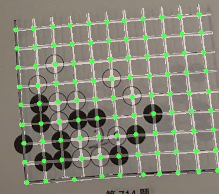
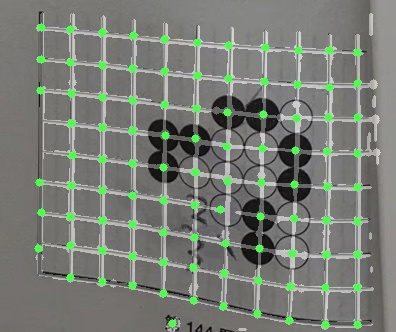
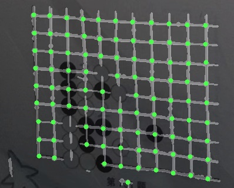

#  GoBoard lines segmentation


## 设计目标

这个项目是在围棋游戏场景下，通过视觉技术解决围棋盘面信息识别的一个尝试。其主要应用于围棋棋盘上的线段的分割任务，将线段的位置准确的从棋盘中识别出来。后续可以再结合例如检测任务匹配各物体之间的关系来实现棋盘信息的准确重建。

## 背景与实现

通常情况下，我们在识别自由拍摄的围棋棋盘图像中的盘面信息时，大都会使用传统的CV算法来实现降噪、定位以及重建的操作。但我们经常遇到的是倾斜的拍摄角度、模糊不清的目标物体和卷曲畸变的目标区域。对于这些在自由拍摄条件下几乎都会碰到的恶劣条件，单纯的采用CV方式进行处理是无法达到一个理想的性能要求的。

通过深度学习的检测任务结合CV方式实现，就可以提升物体干扰与角度倾斜所带来的鲁棒性问题。但是面对扭曲畸变，尤其是书本纸张拍摄场景下的过度卷曲变形则仍然效果不佳。因此尝试采用分割任务实现：

- 利用分割任务位置信息准确度高的特点
- 结合CV算法实现准确的找出棋盘线段交叉点
- 通过交叉点与棋子的位置关系重建棋盘（非分割任务）

分割算法采用UNet实现，以达到更好的性能。

该算法经过少量样本训练达到了很好的效果，更高的性能表现需要更加多样性的数据进行训练。同时这个算法也是解决同类问题的一个尝试，其可以被推广到实现类似的棋盘检测、表格检测等一系列应用领域。

## 环境准备
**Ubuntu 20.04**  
**Python 3.8.x**  

## 如何使用
### 安装 
依赖库: 
```pip install -r requirements.txt```

### 训练
基于预训练模型:
```bash
./train.py [-h] [--train_data TRAIN_DATA] [--val_data VAL_DATA] [--save_path SAVE_PATH] [--pretrained_path PRETRAINED_PATH]
                [--num_epochs NUM_EPOCHS] [--lr LR] [--batch_size BATCH_SIZE] [--imgsz IMGSZ]
```

### 推理 
基于pytorch模型推理:
```bash
./infer.py [-h] --model_path MODEL_PATH [--data_dir DATA_DIR] [--output_dir OUTPUT_DIR] [--imgsz IMGSZ]
```

基于TFLite模型推理:
```bash
./tflite_infer.py [-h] --model_path MODEL_PATH [--data_dir DATA_DIR] [--output_dir OUTPUT_DIR] [--imgsz IMGSZ]
```

**下面是一些可视化的示例:**
<p align="left">
    
    
    
    
</p>

### 导出TFLite
```bash
./export.py [-h] --model_path MODEL_PATH --output_path OUTPUT_PATH [--imgsz IMGSZ]
```